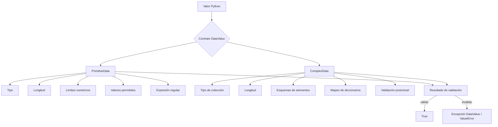
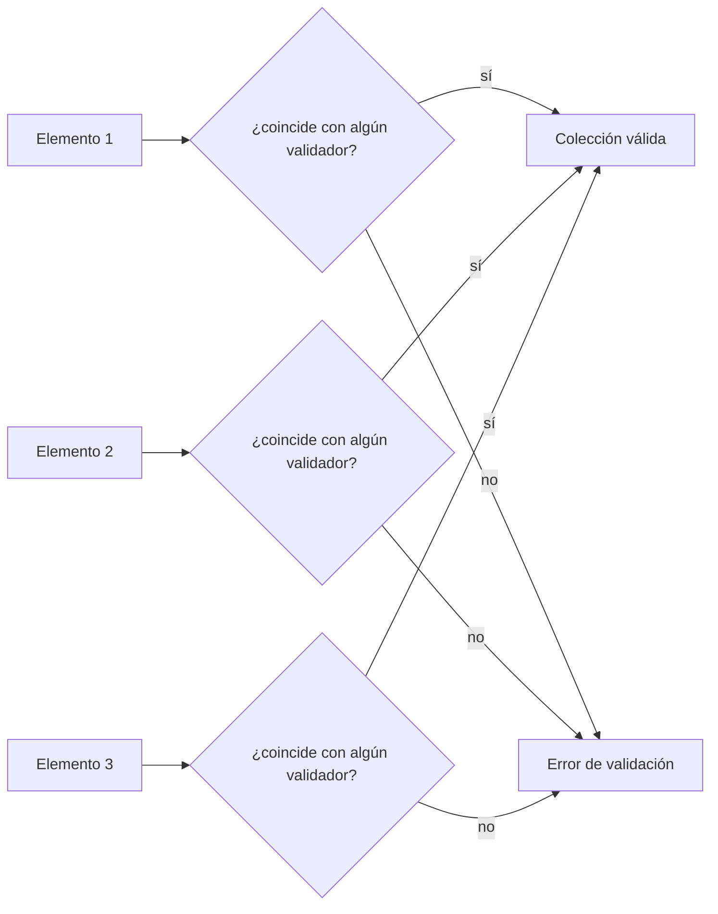
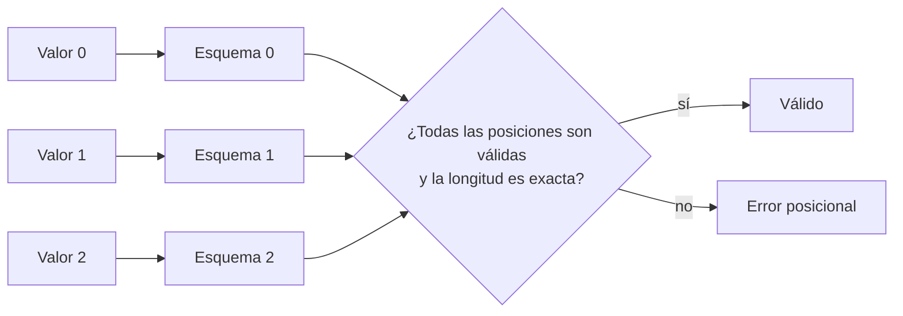

# DataValue

> **Una librería pequeña de contratos y validación de valores en tiempo de ejecución para Python.**  
> Permite definir restricciones sobre valores primitivos y compuestos, componer validadores recursivamente, validar contratos posicionales ordenados y serializar esquemas soportados para almacenamiento o transporte.


---

## Presentación

**DataValue** es una librería ligera de Python para describir y validar datos en tiempo de ejecución.

Su idea central es deliberadamente simple:

```text
valor
  +
tipo Python esperado
  +
restricciones opcionales
  =
contrato de validación DataValue
```

La librería proporciona dos abstracciones principales:

- **`PrimitiveData`** — validación de valores simples o primitivos.
- **`ComplexData`** — validación de valores compuestos y estructuras anidadas.

También expone **`ValidationMode`**, que controla cómo se comparan los elementos de una colección contra los validadores configurados.

DataValue está orientado a proyectos que necesitan una forma compacta, explícita y sin dependencias externas para expresar contratos de valores en tiempo de ejecución sin adoptar un framework de modelado o validación más grande.

---

# ¿Por qué existe DataValue?

Python es dinámicamente tipado. Las anotaciones de tipo mejoran la legibilidad y el análisis estático, pero no aplican por sí mismas restricciones en tiempo de ejecución como:

- valor numérico mínimo o máximo;
- longitud mínima o máxima;
- valores literales permitidos;
- coincidencia mediante expresiones regulares;
- validación de colecciones anidadas;
- restricciones sobre claves y valores de diccionarios;
- contratos posicionales ordenados.

DataValue proporciona una capa pequeña para esos casos.

Por ejemplo:

```python
from datavalue import PrimitiveData

port = PrimitiveData(
    data_type=int,
    value=443,
    minimum_size=1,
    maximum_size=65535,
)

assert port.validate()
```

El objeto representa al mismo tiempo una descripción del valor esperado y, salvo que se configure como plantilla/esquema, un contenedor cuyo valor se valida.

---

# Modelo conceptual



Una instancia configurada de `PrimitiveData` o `ComplexData` también puede formar parte de otro `ComplexData`, lo que permite composición recursiva.

---

# API pública

Actualmente el paquete expone:

```python
from datavalue import PrimitiveData, ComplexData, ValidationMode
```

## `PrimitiveData`

Soporta validación en tiempo de ejecución para:

- `str`
- `int`
- `float`
- `bool`
- `bytes`
- `bytearray`
- `type(None)`

Restricciones disponibles:

- `minimum_length`
- `maximum_length`
- `minimum_size`
- `maximum_size`
- `possible_values`
- `regular_expression`
- `name`
- `description`
- `data_class`

## `ComplexData`

Soporta como tipo raíz:

- `list`
- `tuple`
- `set`
- `frozenset`
- `dict`

Restricciones disponibles:

- `minimum_length`
- `maximum_length`
- `possible_values`
- `validation_mode`
- `name`
- `description`
- `data_class`

## `ValidationMode`

```python
from datavalue import ValidationMode

ValidationMode.ANY
ValidationMode.POSITIONAL
```

### `ANY`

Cada elemento de la colección puede coincidir con **cualquiera** de los validadores configurados.

### `POSITIONAL`

Disponible para `list` y `tuple`.

Cada elemento debe coincidir con el validador ubicado en el mismo índice y la longitud de la colección debe coincidir exactamente con la longitud del esquema.

---

# Lo que DataValue **sí puede hacer**

## 1. Validar valores primitivos en tiempo de ejecución

```python
from datavalue import PrimitiveData

username = PrimitiveData(
    data_type=str,
    value="specter327",
    minimum_length=3,
    maximum_length=32,
    regular_expression=r"^[A-Za-z0-9_-]+$",
)

assert username.validate()
```

---

## 2. Validar rangos numéricos

```python
port = PrimitiveData(
    data_type=int,
    value=8443,
    minimum_size=1,
    maximum_size=65535,
)
```

---

## 3. Restringir valores a un conjunto permitido

```python
protocol = PrimitiveData(
    data_type=str,
    value="TCP",
    possible_values=("TCP", "UDP"),
)
```

`possible_values` puede contener:

- valores literales;
- tipos de Python;
- objetos `PrimitiveData` configurados;
- objetos `ComplexData` configurados cuando se utilizan dentro de esquemas compuestos.

---

## 4. Validar colecciones heterogéneas

Con el modo `ANY`, cada elemento puede coincidir con uno de varios validadores:

```python
schema = ComplexData(
    data_type=list,
    value=None,
    possible_values=(str, int),
    data_class=True,
)

assert schema.validate(["node-a", 10, "node-b", 20])
```

---

## 5. Validar contratos ordenados similares a firmas de funciones

El modo posicional puede describir parámetros o resultados ordenados:

```python
from datavalue import ComplexData, PrimitiveData, ValidationMode

name = PrimitiveData(
    data_type=str,
    value=None,
    minimum_length=1,
    data_class=True,
)

count = PrimitiveData(
    data_type=int,
    value=None,
    minimum_size=1,
    data_class=True,
)

enabled = PrimitiveData(
    data_type=bool,
    value=None,
    data_class=True,
)

contract = ComplexData(
    data_type=list,
    value=None,
    possible_values=(name, count, enabled),
    data_class=True,
    validation_mode=ValidationMode.POSITIONAL,
)

assert contract.validate(["example", 3, True])
```

Esto no satisface el mismo contrato:

```python
contract.validate([3, "example", True])
```

porque los dos primeros valores están intercambiados.

---

## 6. Componer esquemas anidados

Los esquemas pueden contener otros esquemas DataValue.

```python
port = PrimitiveData(
    data_type=int,
    value=None,
    minimum_size=1,
    maximum_size=65535,
    data_class=True,
)

address = PrimitiveData(
    data_type=str,
    value=None,
    minimum_length=1,
    data_class=True,
)

endpoint = ComplexData(
    data_type=dict,
    value=None,
    possible_values={
        "ADDRESS": address,
        "PORT": port,
    },
    data_class=True,
)

assert endpoint.validate({
    "ADDRESS": "192.168.1.10",
    "PORT": 443,
})
```

Esta composición recursiva es una de las capacidades más útiles de DataValue: validadores pequeños pueden combinarse en contratos mayores.

---

## 7. Restringir claves y valores de diccionarios

DataValue soporta dos estilos principales.

### Validadores genéricos de claves y valores

```python
profile = ComplexData(
    data_type=dict,
    value=None,
    possible_values=(
        [str],
        [str, int, bool],
    ),
    data_class=True,
)

assert profile.validate({
    "name": "Specter",
    "level": 10,
    "active": True,
})
```

### Esquemas de mapeo

```python
profile = ComplexData(
    data_type=dict,
    value=None,
    possible_values={
        "name": str,
        "age": int,
        "active": bool,
    },
    data_class=True,
)
```

El modo de mapeo rechaza claves suministradas que no coincidan con alguna regla configurada.

---

## 8. Serializar esquemas DataValue soportados

Ambas clases principales exponen:

```python
to_dict()
to_json()
from_dict(...)
from_json(...)
```

Ejemplo:

```python
encoded = contract.to_json()
restored = ComplexData.from_json(encoded)

assert restored.validate(["example", 3, True])
```

La deserialización utiliza un mapeo controlado de tipos permitidos en lugar de importar clases arbitrarias.

`PrimitiveData` serializa valores `bytes` y `bytearray` mediante Base64.

---

## 9. Capturar valores de forma interactiva desde terminal

Ambas clases proporcionan una interfaz `cli_capture()`.

Ejemplo:

```python
port = PrimitiveData(
    data_type=int,
    value=None,
    name="Port",
    minimum_size=1,
    maximum_size=65535,
    data_class=True,
)

value = port.cli_capture()
```

`ComplexData.cli_capture()` puede recorrer recursivamente determinados esquemas de colecciones y mapeos.

Esta capacidad debe entenderse como una interfaz auxiliar para flujos simples de terminal, no como un framework completo de formularios.

---

# Lo que DataValue **no puede hacer**

DataValue no debe confundirse con un lenguaje de esquemas completo, un sistema de tipos estático, un ORM, un protocolo de serialización universal o una barrera de seguridad.

## 1. No realiza tipado estático

DataValue valida valores **en tiempo de ejecución**.

No reemplaza:

- anotaciones de tipo;
- `mypy`;
- Pyright;
- un compilador o type checker.

---

## 2. No es un framework completo de modelos de datos

DataValue no ofrece actualmente la amplitud de sistemas como:

- Pydantic;
- attrs;
- Marshmallow;
- ecosistemas basados en `dataclasses`;
- implementaciones completas de JSON Schema.

No incorpora:

- generación automática de modelos desde anotaciones;
- sistema complejo de campos;
- herencia de modelos;
- decoradores de validación;
- ecosistema de plugins;
- integración OpenAPI;
- integración ORM.

---

## 3. Los mapeos de diccionarios no exigen campos obligatorios

Un esquema de mapeo restringe las claves que están presentes, pero la implementación actual **no verifica que todas las claves declaradas en el esquema existan**.

Por ejemplo:

```python
schema = ComplexData(
    data_type=dict,
    value=None,
    possible_values={
        "name": str,
        "age": int,
    },
    data_class=True,
)
```

El esquema define cómo pueden ser los campos suministrados, pero no significa actualmente que ambos campos sean obligatorios.

Si se requieren campos obligatorios, esa semántica debe implementarse por el consumidor o añadirse como una característica adicional.

---

## 4. La validación de tipo usa semántica `isinstance()`

DataValue utiliza actualmente `isinstance()` para comparar tipos.

Por tanto, se aplican las relaciones de subclases de Python.

Ejemplo:

```python
isinstance(True, int)  # True
```

Un validador `int` no equivale exactamente a:

```python
type(value) is int
```

Si una aplicación requiere identidad exacta de tipo, debe considerar este comportamiento.

---

## 5. No valida objetos Python arbitrarios

Las abstracciones públicas están centradas en tipos primitivos y colecciones integradas soportadas.

No es un motor general de esquemas para cualquier clase u objeto Python.

---

## 6. La serialización no es universal

La serialización está orientada al dominio soportado por DataValue.

No reemplaza:

- `pickle`;
- MessagePack;
- CBOR;
- Protobuf;
- sistemas generales de persistencia de objetos.

Limitaciones actuales relevantes:

- `bytes` crudos anidados directamente dentro de un `ComplexData` no son universalmente JSON-safe;
- la identidad de `set`/`frozenset` anidados no está garantizada en todos los round-trips;
- claves de diccionario no convencionales pueden no reconstruirse de forma exacta;
- sólo se reconstruyen tipos explícitamente admitidos.

---

## 7. No define un protocolo de red

`to_json()` permite representar ciertos esquemas como texto JSON, pero DataValue no implementa:

- framing;
- sockets;
- HTTP;
- autenticación;
- cifrado;
- orden de mensajes;
- negociación de protocolo;
- negociación de compatibilidad.

El transporte es responsabilidad de la aplicación que utilice DataValue.

---

## 8. No es una barrera de seguridad

Que un valor sea válido según DataValue significa que cumple las reglas estructurales configuradas.

No significa automáticamente que el valor sea:

- confiable;
- autenticado;
- autorizado;
- seguro para ejecutar;
- libre de contenido malicioso.

Validación y política de seguridad son conceptos distintos.

---

## 9. No dispone de evolución madura del formato de esquemas

Los esquemas serializados contienen campos específicos de implementación, pero actualmente no existe:

- versión independiente del formato;
- sistema de migraciones;
- negociación de compatibilidad de esquema.

Las aplicaciones que persistan contratos a largo plazo deberían versionar su propio formato envolvente.

---

## 10. No dispone todavía de un pipeline maduro de CI/release

El repositorio contiene scripts de empaquetado, publicación, ejemplos y pruebas, pero no presenta actualmente una configuración visible de integración continua.

Por tanto, no debe asumirse que cada versión publicada haya pasado automáticamente una suite canónica antes de publicarse.

---

# Modo valor y modo esquema

Tanto `PrimitiveData` como `ComplexData` aceptan el parámetro `data_class`.

## Modo valor

Por defecto:

```python
data_class=False
```

El valor suministrado se valida durante la construcción.

```python
port = PrimitiveData(
    data_type=int,
    value=443,
    minimum_size=1,
    maximum_size=65535,
)
```

## Modo esquema o plantilla

```python
data_class=True
```

La construcción no valida inmediatamente el valor almacenado. El objeto puede reutilizarse:

```python
port_schema = PrimitiveData(
    data_type=int,
    value=None,
    minimum_size=1,
    maximum_size=65535,
    data_class=True,
)

port_schema.validate(22)
port_schema.validate(443)
port_schema.validate(65535)
```

Conceptualmente:

```text
data_class = False
    contrato + valor
         ↓
 validación inmediata

data_class = True
    contrato reutilizable
         ↓
 validate(valor)
         ↓
 validate(otro_valor)
```

---

# Comportamiento de validación

## Restricciones primitivas

| Restricción | `str` | `bytes` / `bytearray` | `int` / `float` | `bool` |
|---|---:|---:|---:|---:|
| Tipo | Sí | Sí | Sí | Sí |
| Longitud mínima/máxima | Sí | Sí | Conteo de dígitos | N/A |
| Magnitud mínima/máxima | N/A | N/A | Sí | No orientado |
| Valores permitidos | Sí | Sí | Sí | Sí |
| Regex | Sí | Sí | N/A | N/A |

En números, `minimum_length` y `maximum_length` cuentan dígitos.

Si lo que se desea es limitar magnitud numérica, debe utilizarse `minimum_size` / `maximum_size`.

---

# Modos de validación compuesta

## Modo ANY



Ejemplo:

```python
schema = ComplexData(
    data_type=list,
    value=None,
    possible_values=(str, int),
    data_class=True,
)

schema.validate(["A", 1, "B", 2])
```

---

## Modo POSITIONAL



Ejemplo:

```python
schema = ComplexData(
    data_type=tuple,
    value=None,
    possible_values=(str, int, bool),
    data_class=True,
    validation_mode="positional",
)

assert schema.validate(("node", 443, True))
```

---

# Excepciones

DataValue define una jerarquía pequeña de excepciones:

```text
DataValueException
├── DataTypeException
├── LengthException
│   └── PositionalLengthException
├── SizeException
├── PossibleValueException
│   └── PositionalValueException
├── RegularExpressionException
└── ValidationModeException
```

`PositionalLengthException` expone:

```python
expected
received
```

`PositionalValueException` expone:

```python
index
value
schema
```

Esto permite a las aplicaciones presentar diagnósticos más ricos que un simple error genérico.

---

# Instalación

Requiere Python **3.10 o superior**.

```bash
pip install datavalue
```

Actualmente el paquete no declara dependencias externas de runtime.

---

# Estructura del proyecto

```text
DataValue/
├── datavalue/
│   ├── __init__.py
│   ├── classes/
│   │   ├── primitive_data.py
│   │   └── complex_data.py
│   └── exceptions/
│       └── __init__.py
├── docs/
│   ├── primitive.md
│   └── complex.md
├── tests/
│   ├── PrimitiveData_test.py
│   ├── ComplexData_test.py
│   ├── datavalue_positional.py
│   └── example_positional.py
├── pyproject.toml
├── publish.sh
└── upgrade.sh
```

---

# Evaluación técnica actual

DataValue se describe de forma más precisa como:

> **una librería temprana, sin dependencias externas, para expresar contratos de valores en tiempo de ejecución, con composición recursiva, validación posicional, serialización JSON orientada a esquemas y captura CLI simple.**

Actualmente contiene más que una colección de validaciones ad-hoc:

- validador primitivo reutilizable;
- validador compuesto reutilizable;
- composición anidada;
- dos semánticas de validación de colecciones;
- validación de mappings;
- excepciones específicas;
- serialización y deserialización recursiva;
- compatibilidad del modo histórico `ANY`;
- captura interactiva en terminal.

Al mismo tiempo, sigue siendo una librería pequeña y no debe presentarse como un ecosistema completo de validación.

---

# Estado de las pruebas

El repositorio incluye diferentes tipos de evidencia de validación:

- ejemplos ejecutables de `PrimitiveData`;
- ejemplos ejecutables de `ComplexData`;
- suite `unittest` para validación posicional;
- pruebas de round-trip de serialización;
- pruebas de esquemas anidados;
- pruebas de compatibilidad con el comportamiento histórico `ANY`.

La suite posicional cubre específicamente:

- compatibilidad del modo `ANY`;
- orden posicional;
- valores faltantes;
- valores adicionales;
- restricciones primitivas anidadas;
- contratos posicionales sobre tuplas;
- literales posicionales;
- contratos vacíos;
- tipos de colección no soportados en modo posicional;
- modos desconocidos;
- esquemas anidados;
- round-trips JSON.

Sin embargo, la organización actual de pruebas tiene limitaciones:

- los nombres no siguen completamente una convención de discovery automática;
- algunos archivos son demostraciones con `print()` más que pruebas assertion-driven;
- no existe CI visible;
- no existe reporte de cobertura visible;
- no debe asumirse corrección exhaustiva a partir de las pruebas existentes.

---

# Limitaciones técnicas conocidas y áreas de mejora

## Semántica de tipo exacto

Sería útil considerar un modo opcional de tipo exacto si “estricto” debe significar:

```python
type(value) is expected_type
```

en lugar de la semántica basada en `isinstance()`.

## Campos obligatorios en diccionarios

Los mappings se beneficiarían de una semántica explícita de campos:

```text
required:
  - uid
  - name

optional:
  - description
```

## Versión de formato de serialización

Un campo como:

```json
{
  "DATAVALUE_FORMAT": 1
}
```

permitiría evolucionar de forma más segura los esquemas persistidos.

## Cobertura de serialización

`bytes`, colecciones anidadas y claves no triviales deberían contar con una matriz explícita de soporte y round-trip.

## Consistencia de CLI

La interpretación booleana entre `PrimitiveData` y `ComplexData` debería ser homogénea.

## Suite de pruebas canónica

Una organización como:

```text
tests/
├── test_primitive.py
├── test_complex.py
├── test_mapping.py
├── test_positional.py
├── test_serialization.py
└── test_cli.py
```

facilitaría `pytest` o `unittest discover`.

## CI antes de publicación

El ciclo de release debería idealmente ser:

```text
lint
  ↓
tests
  ↓
build
  ↓
validación del paquete
  ↓
publicación
  ↓
tag/release
```

---

# Casos de uso previstos

DataValue es razonable para sistemas pequeños o controlados que necesiten:

- validación de parámetros en runtime;
- contratos ligeros de aplicación;
- validación de payloads;
- configuración;
- esquemas reutilizables;
- contratos ordenados de argumentos o resultados;
- estructuras anidadas simples;
- persistencia de esquemas en los casos soportados.

Ejemplos:

```text
parámetros de funciones
configuración
descripciones de endpoints
mensajes de aplicación
entrada CLI
resultados estructurados
contratos internos pequeños
```

---

# Cuándo conviene otra herramienta

Es mejor utilizar un framework de validación/modelado más grande cuando se necesitan:

- modelos generados desde anotaciones;
- soporte completo o estandarizado de JSON Schema;
- coerción avanzada;
- alias de campos;
- validadores/decoradores extensos;
- integración OpenAPI;
- integración ORM;
- ecosistema amplio de plugins.

Es mejor utilizar un sistema de serialización o protocolo cuando se necesitan:

- esquemas cross-language;
- codificación binaria compacta;
- contratos de red fuertemente versionados;
- generación de tipos cliente/servidor.

Es mejor utilizar herramientas de typing estático cuando el objetivo es análisis en editor o durante CI antes de ejecutar el código.

DataValue es deliberadamente más limitado que todas esas categorías.

---

# Filosofía de diseño

DataValue funciona mejor entendido como una capa pequeña de contratos en tiempo de ejecución:

```text
semántica de aplicación
        ↓
contrato DataValue
        ↓
valor runtime
        ↓
validación
```

Debe conservarse explícita la diferencia entre:

```text
validación
≠
autenticación
≠
autorización
≠
confianza
≠
ejecución segura
```

Un valor puede ser estructuralmente válido y seguir siendo semánticamente malicioso o no autorizado.

---

# Madurez

| Área | Estado actual |
|---|---|
| Validación primitiva | Implementada |
| Validación compuesta | Implementada |
| Esquemas anidados | Implementados |
| Contratos posicionales | Implementados |
| Mapping de diccionarios | Implementado |
| Round-trip JSON de esquemas | Implementado para casos soportados |
| Captura CLI | Implementada, limitada |
| Pruebas de regresión automatizadas | Parciales |
| Integración continua | No presente |
| Cobertura | No presente |
| Campos obligatorios en mappings | No implementados |
| Migraciones de formato de esquema | No implementadas |
| Modelado general de objetos | Fuera de alcance |
| Tipado estático | Fuera de alcance |
| Barrera de seguridad | Fuera de alcance |

---

# Versión

Metadatos actuales del paquete:

```text
DataValue 0.1.21
Python >= 3.10
Dependencias externas de runtime: ninguna
```

---

# Licencia

El repositorio actualmente no contiene un archivo de licencia.

Hasta que se añada una licencia explícita, no debe asumirse que el código puede reutilizarse, modificarse o redistribuirse sin restricciones.

---

# Resumen

**DataValue no pretende ser un framework universal de modelado para Python.**

Proporciona un vocabulario compacto para expresar:

```text
tipo esperado
+
forma permitida
+
restricciones
+
contratos anidados
+
serialización opcional
```

y validar valores Python reales contra esas reglas.

Sus capacidades actuales más fuertes son:

- núcleo pequeño y sin dependencias externas;
- composición recursiva;
- contratos posicionales;
- validación runtime explícita;
- serialización estructurada para los casos soportados.

Sus limitaciones son igualmente importantes:

- los mappings no expresan todavía campos obligatorios;
- `isinstance()` no equivale a identidad exacta de tipo;
- la serialización está acotada;
- la CLI es auxiliar;
- el pipeline de pruebas y publicación todavía es inmaduro.

Ese alcance es deliberado y debe mantenerse explícito.